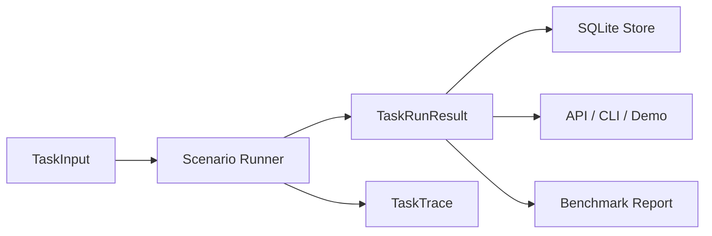

# HybridArena AgentBench

**面向 AI Agent、RAG、评测与通信数智化岗位的本地可运行 AgentBench 平台。**

[]()
[]()

HybridArena 原本是 LLM Planner x DRL Control 的 MiniMOBA 研究项目。当前主线已重构为 **AgentBench**：保留 planner、evaluator、trace、demo 的工程抽象，把主展示迁移到 JD 解析、通信 RAG、网络工单分诊三个业务场景。MiniMOBA/RL 仍作为研究支线保留。

## 当前主线

| 场景 | 能证明的能力 | 当前实现 |
|---|---|---|
| JD 解析与简历差距分析 | Agent workflow、结构化输出、求职材料改写 | taxonomy + evidence span + gap report |
| 通信知识库 RAG Copilot | RAG、引用式回答、通信领域理解 | JSONL corpus + token retriever + citations |
| 网络工单分诊与评测台 | AI 测试评测、通信数智化、批处理 | rule classifier + 排障建议 + Macro-F1 |

## 快速开始

```bash
pip install -e ".[dev,app,rl]"

pytest hybrid_arena/core hybrid_arena/scenarios hybrid_arena/services/api hybrid_arena/scripts/tests -v

uvicorn hybrid_arena.services.api.app:app --reload
streamlit run hybrid_arena/demo/app.py
```

## AgentBench CLI

```bash
python -m hybrid_arena.scripts.agentbench_run \
  --scenario jd_resume_match \
  --input datasets/jd_samples/jd_cases.jsonl \
  --output results/agentbench/jd_report.json

python -m hybrid_arena.scripts.agentbench_run \
  --scenario telecom_rag \
  --input datasets/telecom_docs/rag_eval_cases.jsonl \
  --output results/agentbench/rag_report.json

python -m hybrid_arena.scripts.agentbench_run \
  --scenario ticket_triage \
  --input datasets/ticket_samples/ticket_cases.jsonl \
  --output results/agentbench/ticket_report.json
```

每个命令会同时生成 JSON 和 Markdown 报告。

## API

启动：

```bash
uvicorn hybrid_arena.services.api.app:app --reload
```

接口：

| Method | Path | 说明 |
|---|---|---|
| GET | `/health` | 服务健康检查 |
| GET | `/scenarios` | 列出场景 |
| POST | `/tasks/run` | 运行一次 AgentBench task |
| GET | `/runs` | 列出历史 run |
| GET | `/runs/{run_id}` | 查看单次 run 与 trace |

示例：

```json
{
  "task_id": "jd-001",
  "scenario": "jd_resume_match",
  "payload": {
    "jd_text": "需要 Python、FastAPI、RAG 和评测经验。",
    "resume_profile": {
      "skills": ["python_backend"],
      "evidence": {"python_backend": ["HybridArena CLI"]}
    }
  },
  "metadata": {"run_id": "run-001"}
}
```

## 架构

```text
hybrid_arena/
├── core/                 # TaskInput / TaskRunResult / trace / SQLite / reporting
├── scenarios/            # jd_resume_match / telecom_rag / ticket_triage
├── services/api/         # FastAPI app
├── scripts/              # agentbench_run + research scripts
├── demo/                 # Streamlit AgentBench demo
├── minimoba/             # research branch: PettingZoo MOBA environment
├── algorithms/           # research branch: PPO/MAPPO/QMIX/COMA
└── training/             # research branch: RL trainer/evaluator
```

核心数据流：



## Trace Contract

所有场景返回同一种结果：

```python
TaskRunResult(
    run_id="...",
    task_id="...",
    scenario="jd_resume_match | telecom_rag | ticket_triage",
    output={...},
    metrics={...},
    trace=TaskTrace(steps=[ToolCallRecord(...)]),
)
```

这保证 API、CLI、Streamlit demo 和离线评测共用同一套 runner。

## 研究支线

MiniMOBA/RL 仍保留：

- PettingZoo Parallel API 环境。
- MultiDiscrete([9, 4, 9]) joint action space。
- 324-way action mask 与 PPO/DualClipPPO 训练闭环。
- tower/base objective game、checkpoint、train/evaluate/run_ablation CLI。

研究支线当前状态见 `docs/report.md`：F13 objective reward shaping 提升了 tower damage，但 hard_win_rate、base_exposed_rate、avg_base_damage 仍为 0，暂不继续长训。

## 测试

```bash
pytest hybrid_arena/core hybrid_arena/scenarios hybrid_arena/services/api hybrid_arena/scripts/tests -v
pytest hybrid_arena/minimoba/tests hybrid_arena/training/tests hybrid_arena/algorithms/tests -v
ruff check hybrid_arena
```

## 面试材料

- `docs/agentbench-architecture.md`
- `docs/agentbench-demo-script.md`
- `docs/agentbench-resume-bullets.md`
- `docs/agentbench-benchmark-report.md`

## License

MIT
