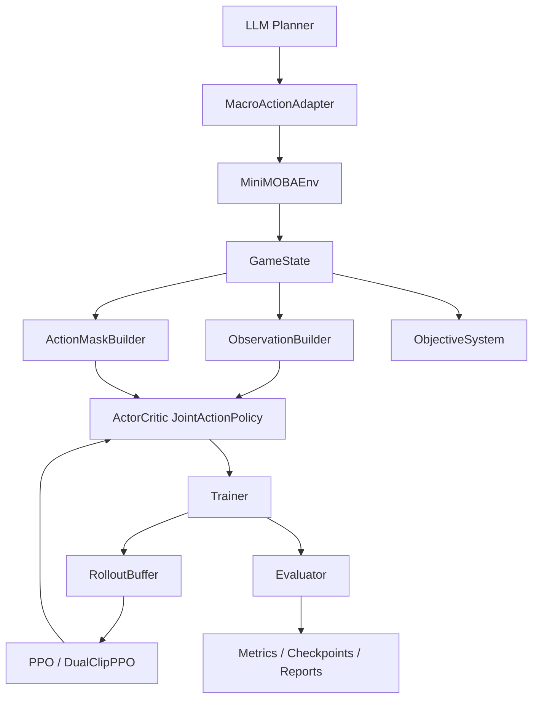

# HybridArena

**LLM Planner × DRL Control · MiniMOBA 4v4 多智能体研究平台**

[]()
[]()

HybridArena 是一个 LLM 高层规划 + 深度强化学习微操控制的混合智能体研究平台，载体为 PettingZoo 标准的 4v4 简化 MOBA 环境（MiniMOBA）。项目同时提供 AgentBench 应用层，将 planner、evaluator、trace 能力扩展到 JD 解析、通信 RAG、工单分诊三个业务场景。

## 核心能力

| 模块 | 说明 | 状态 |
|------|------|------|
| MiniMOBA 环境 | PettingZoo Parallel API，4v4 MOBA，324 联合动作，战争迷雾 | 已完成 |
| 动作系统 | MultiDiscrete([9,4,9])，324-way action mask | 已完成 |
| PPO / DualClipPPO | 训练正确性修复，joint categorical policy | 已完成 |
| MAPPO / QMIX / COMA | 多智能体算法框架 | 已完成 |
| 塔/基地目标系统 | ObjectiveSystem，推塔/基地经济/胜负条件 | 已完成 |
| Self-play / Curriculum | 历史策略池、ELO、对手采样、难度切换 | 已完成 |
| LLM Planner MVP | 高层战术规划（团战/分推/发育），Rule + Dummy LLM 对照 | 已完成 |
| 实验系统 | train / evaluate / run_ablation CLI，checkpoint，seed sweep | 已完成 |
| AgentBench 应用层 | JD 解析、通信 RAG、工单分诊，FastAPI + Streamlit | 已完成 |

## 双主线维护边界

HybridArena 采用双主线维护，但验收边界保持独立：

- **MiniMOBA/RL 主线**：负责 PettingZoo 环境、324 联合动作、目标系统、RL 算法、训练/评估、LLM Planner MVP 与 ISSUE-F13 后续验证。当前重点是正式实验与训练有效性验证。
- **AgentBench 应用层**：负责 `core`、`scenarios`、`services/api`、`agentbench_run`、reporting 与 AgentBench Demo。首版已完成，后续作为应用层独立维护。
- **共享交付面**：README、`docs/`、ruff、全量测试和交接记录。任何变更必须说明影响哪条主线，并运行对应门禁。

M0 范围冻结记录见 `docs/scope-freeze-m0.md`。

## 快速开始

```bash
pip install -e ".[dev,rl]"

# 环境与算法测试
pytest hybrid_arena/minimoba/tests hybrid_arena/training/tests hybrid_arena/algorithms/tests -v

# 训练
python -m hybrid_arena.scripts.train --algo ppo_dualclip --seed 42 --total-timesteps 512 --num-steps 32 --device cpu

# 评估
python -m hybrid_arena.scripts.evaluate --opponent rule_based --episodes 3 --seed 42 --output results/eval_smoke.json

# Planner 演示
python -m hybrid_arena.scripts.play_planner --planner rule --max-steps 50 --render-mode none

# MOBA Demo（Streamlit）
streamlit run hybrid_arena/demo/moba_app.py

# 键盘控制
python hybrid_arena/scripts/play_human.py
```

## 架构

```text
hybrid_arena/
├── minimoba/             # MiniMOBA 环境：PettingZoo 4v4 MOBA
│   ├── game_engine.py    # 核心仿真：地图、英雄、战斗、迷雾
│   ├── env.py            # ParallelEnv 封装
│   ├── action_encoding.py # 324 联合动作编解码
│   ├── objectives.py     # 塔/基地目标系统
│   └── reward_shaper.py  # 奖励配置
├── algorithms/           # RL 算法：PPO / DualClipPPO / MAPPO / QMIX / COMA
│   └── networks.py       # CNN + 联合策略网络
├── training/             # 训练闭环：Trainer / Buffer / Evaluator / Self-play
├── inference/            # LLM Planner：状态摘要 → 宏观指令 → 策略偏置
├── core/                 # AgentBench 应用层：schema / trace / SQLite / reporting
├── scenarios/            # AgentBench 场景：jd_resume_match / telecom_rag / ticket_triage
├── services/api/         # FastAPI 接口
├── scripts/              # CLI：train / evaluate / run_ablation / agentbench_run
├── demo/                 # Streamlit：moba_app.py（主线）/ app.py（AgentBench）
└── skill_runtime/        # Skill Runtime 扩展原型
```

### 数据流



## 环境规格

- **Agent**: 红蓝各 4 名英雄（`red_0..3`, `blue_0..3`）
- **Action Space**: `MultiDiscrete([9, 4, 9])` — 移动(9) × 技能(4) × 目标(9) = 324
- **Observation**: `Dict` — `local_map (11,11,11)` / `self_state (20,)` / `teammate_states (3,15)` / `global_info (10,)` / `action_mask (324,)`
- **目标硬件**: RTX 4060 Laptop (8GB VRAM)
- **性能目标**: > 500 FPS

## 已知问题

**ISSUE-F13**：objective reward shaping 提升了 `tower_damage`，但 `hard_win_rate=0.0`、`base_exposed_rate=0.0`、`avg_base_damage=0.0`。需先验证 scripted objective policy 能稳定触达 base 目标后再考虑长训。详见 `docs/issues.md`。

## AgentBench 应用层（可选）

AgentBench 将平台的 planner、evaluator、trace 能力扩展到三个业务场景，可独立运行：

```bash
pip install -e ".[app]"

# AgentBench CLI
python -m hybrid_arena.scripts.agentbench_run --scenario jd_resume_match --input datasets/jd_samples/jd_cases.jsonl --output results/agentbench/jd_report.json

# FastAPI
uvicorn hybrid_arena.services.api.app:app --reload

# AgentBench Demo
streamlit run hybrid_arena/demo/app.py
```

| 场景 | 说明 | 实现 |
|------|------|------|
| JD 解析与简历差距分析 | Agent workflow、结构化输出 | taxonomy + evidence span + gap report |
| 通信知识库 RAG Copilot | RAG、引用式回答 | JSONL corpus + token retriever + citations |
| 网络工单分诊与评测台 | AI 评测、批处理 | rule classifier + 排障建议 + Macro-F1 |

## 发布门禁

```bash
# RL 主线（环境 + 训练 + 算法）
pytest hybrid_arena/minimoba/tests hybrid_arena/training/tests hybrid_arena/algorithms/tests -v

# AgentBench 应用层
pytest hybrid_arena/core hybrid_arena/scenarios hybrid_arena/services/api hybrid_arena/scripts/tests -v

# Lint
ruff check hybrid_arena

# 全量回归（M4 / 交接验收）
pytest hybrid_arena/ -v
```

## 文档

- `docs/plan.md` — 活跃开发计划
- `docs/progress.md` — 阶段进度
- `docs/issues.md` — 问题记录
- `docs/architecture.md` — RL 下一阶段架构设计
- `docs/scope-freeze-m0.md` — 双主线边界、测试门禁与 M1/M2 输入清单
- `docs/experiment-report-v0.md` — RL 实验报告
- `docs/agentbench-architecture.md` — AgentBench 应用层架构
- `docs/refs/` — 技术参考

## License

MIT
