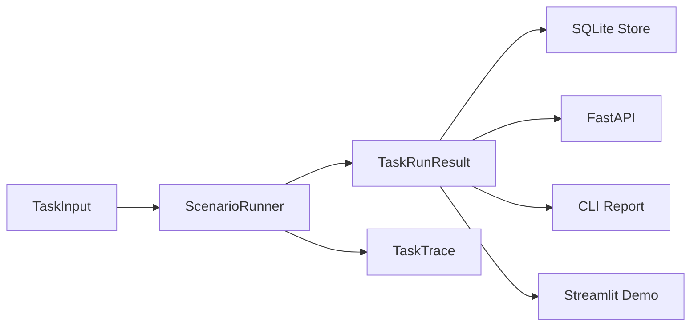

# HybridArena AgentBench Architecture

## 定位

AgentBench 是 HybridArena 的求职展示主线。它将原项目中的 planner、evaluator、trace、demo 能力迁移到三类业务任务：JD 解析、通信 RAG、工单分诊。

## 模块

```text
hybrid_arena/
├── core/
│   ├── schema.py      # TaskInput, TaskRunResult, TaskTrace, BenchmarkResult
│   ├── traces.py      # TraceRecorder, JsonlTraceWriter
│   ├── storage.py     # SQLite run storage
│   └── reporting.py   # Markdown benchmark report
├── scenarios/
│   ├── jd_resume_match/
│   ├── telecom_rag/
│   └── ticket_triage/
├── services/api/
├── scripts/agentbench_run.py
└── demo/app.py
```

## 数据流



## 设计边界

- 不依赖外部 LLM API，保证测试和 demo 可离线运行。
- LLM、embedding、向量库可后续作为 adapter 接入，不影响当前 runner contract。
- MiniMOBA/RL 保留为 research branch，不再作为求职展示主线。

## 关键接口

- `TaskInput`：场景、任务 id、输入 payload、metadata。
- `TaskRunResult`：输出、指标、trace。
- `TaskTrace`：步骤级工具调用记录。
- `BenchmarkResult`：离线评测结果。

## API

- `GET /health`
- `GET /scenarios`
- `POST /tasks/run`
- `GET /runs`
- `GET /runs/{run_id}`
