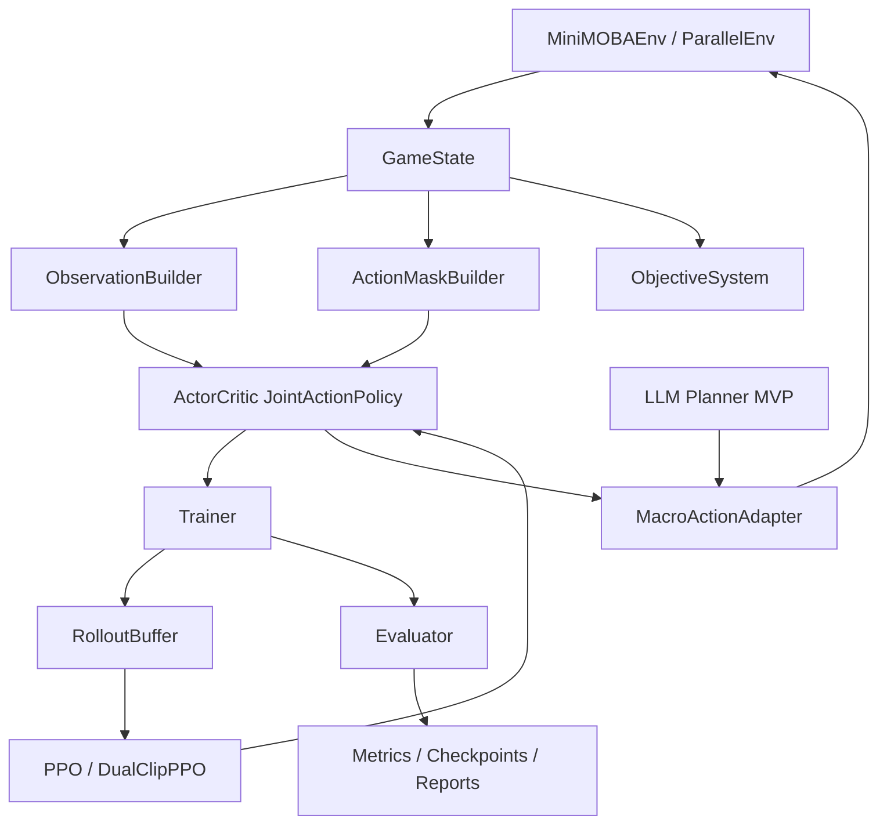

# HybridArena 下一阶段系统架构设计

生成日期：2026-04-29

## 1. 架构目标

下一阶段不重写项目，而是在现有代码上完成四个目标：

1. 修复 PPO 训练有效性：action mask、old values、value clipping、dual-clip metrics。
2. 补完 MiniMOBA 核心目标：塔、基地、队伍经济、胜负条件、目标奖励。
3. 建立可复现实验系统：CLI、evaluator、checkpoint、ablation、结果表。
4. 在稳定 RL baseline 上接入 LLM 高层 Planner MVP。

## 1.1 双主线维护边界

本架构文档描述 MiniMOBA/RL 主线。HybridArena 同时保留 AgentBench 应用层，但两条主线独立验收：

- MiniMOBA/RL：环境、动作系统、目标系统、算法、训练/评估、LLM Planner MVP 与 ISSUE-F13 后续验证。
- AgentBench：`core`、`scenarios`、`services/api`、CLI、reporting 与 Streamlit AgentBench demo。
- 共享项：README、`docs/`、ruff、全量测试与交接记录。

后续 M1/M2/M3/M4 范围和三类测试门禁以 `docs/scope-freeze-m0.md` 为准。

## 2. 架构总览



## 3. 模块划分

### 模块 A：环境正确性基线

- 职责：保证 PettingZoo API、seed determinism、动作合法性、奖励范围、渲染稳定。
- 输入：agent action dict。
- 输出：observations、rewards、terminations、truncations、infos。
- 依赖：`GameState`、`RewardConfig`、`Renderer`。
- 核心文件：
  - `hybrid_arena/minimoba/env.py`
  - `hybrid_arena/minimoba/game_engine.py`
  - `hybrid_arena/minimoba/tests/test_api.py`

### 模块 B：动作编码与 Action Mask

- 职责：统一 flat action 与 `[move, skill, target]` 的编码/解码，确保环境、网络、buffer、测试使用同一语义。
- 输入：`np.ndarray([move, skill, target])` 或 flat action index。
- 输出：joint action mask `(324,)`、flat action、decoded action。
- 新增文件：
  - `hybrid_arena/minimoba/action_encoding.py`
  - `hybrid_arena/minimoba/action_masks.py`
  - `hybrid_arena/minimoba/tests/test_action_mask.py`
- 核心接口：
  - `encode_action(move: int, skill: int, target: int) -> int`
  - `decode_action(index: int) -> tuple[int, int, int]`
  - `build_joint_action_mask(game_state: GameState, hero: HeroState) -> np.ndarray`

### 模块 C：JointActionPolicy

- 职责：用现有 move/skill/target 三个 head 构造 `(B,324)` joint logits，严格使用 full action mask。
- 输入：batched observation dict、action mask。
- 输出：action `(B,3)`、log_prob `(B,)`、entropy `(B,)`、value `(B,)`。
- 修改文件：
  - `hybrid_arena/algorithms/networks.py`
- 新增测试：
  - `hybrid_arena/algorithms/tests/test_joint_action_policy.py`

### 模块 D：PPO 训练核心

- 职责：修复 rollout/buffer/update 的训练一致性。
- 输入：obs、actions、old_log_probs、old_values、action_masks、returns、advantages。
- 输出：loss 与训练指标。
- 修改文件：
  - `hybrid_arena/training/buffer.py`
  - `hybrid_arena/training/trainer.py`
  - `hybrid_arena/algorithms/ppo/ppo.py`
  - `hybrid_arena/algorithms/ppo/ppo_dualclip.py`
- 核心接口：
  - `RolloutBuffer.add(..., action_mask_batch, value_batch)`
  - `PPO.update(..., action_masks, old_values)`

### 模块 E：ObjectiveSystem

- 职责：让 MiniMOBA 从团战模拟变成有推塔/基地/经济目标的 objective game。
- 输入：英雄位置、技能/攻击事件、塔/基地状态。
- 输出：结构物伤害、塔奖励、基地奖励、终局。
- 新增文件：
  - `hybrid_arena/minimoba/objectives.py`
  - `hybrid_arena/minimoba/events.py`
  - `hybrid_arena/minimoba/tests/test_objectives.py`
- 核心类：
  - `StructureState`
  - `ObjectiveSystem`
  - `GameEvent`

### 模块 F：评估与实验系统

- 职责：提供可复现实验命令，生成胜率、reward、episode length、KDA、tower damage、FPS、checkpoint。
- 输入：训练好的 policy、opponent 配置、seed 列表。
- 输出：JSON/CSV/Markdown 报告。
- 新增文件：
  - `hybrid_arena/training/evaluator.py`
  - `hybrid_arena/training/checkpoint.py`
  - `hybrid_arena/scripts/train.py`
  - `hybrid_arena/scripts/evaluate.py`
  - `hybrid_arena/scripts/run_ablation.py`
  - `hybrid_arena/training/tests/test_evaluator.py`

### 模块 G：Self-play 与 Curriculum

- 职责：实现历史策略池、对手采样、难度阶段切换。
- 输入：当前 policy checkpoint、history pool、win rate。
- 输出：opponent policy、curriculum level 更新。
- 新增文件：
  - `hybrid_arena/training/self_play.py`
  - `hybrid_arena/training/curriculum.py`
  - `hybrid_arena/training/tests/test_self_play.py`
  - `hybrid_arena/training/tests/test_curriculum.py`

### 模块 H：LLM Planner MVP

- 职责：接入高层策略规划，但不直接替代底层 RL 微操。
- 输入：压缩后的队伍态势摘要。
- 输出：macro action。
- 新增文件：
  - `hybrid_arena/inference/planner_state.py`
  - `hybrid_arena/inference/macro_actions.py`
  - `hybrid_arena/inference/llm_planner.py`
  - `hybrid_arena/inference/rule_planner.py`
  - `hybrid_arena/inference/adapter.py`
  - `hybrid_arena/inference/tests/test_planner_contract.py`

## 4. 数据流

### 4.1 RL 训练流

```text
MiniMOBAEnv.reset
  -> observations with action_mask
  -> ActorCritic.get_action_and_value(obs, action_mask)
  -> env.step(action_dict)
  -> RolloutBuffer.add(obs, action, log_prob, value, reward, done, action_mask)
  -> RolloutBuffer.get_batch(next_values, next_dones)
  -> PPO.update(obs, actions, old_log_probs, old_values, advantages, returns, action_masks)
  -> checkpoint/evaluation/logging
```

### 4.2 LLM Planner 推理流

```text
GameState
  -> planner_state.summarize_game_state()
  -> LLMPlanner.plan() or RulePlanner.plan()
  -> MacroActionAdapter.to_policy_bias()
  -> low-level RL policy / rule policy
  -> env.step()
```

## 5. 关键接口定义

### 5.1 动作编码

```python
def encode_action(move: int, skill: int, target: int) -> int:
    """Return flat index in [0, 323]."""


def decode_action(index: int) -> tuple[int, int, int]:
    """Return (move, skill, target)."""
```

### 5.2 JointActionPolicy

```python
def get_action_and_value(
    self,
    obs: dict[str, torch.Tensor],
    action: torch.Tensor | None = None,
    action_mask: torch.Tensor | None = None,
) -> tuple[torch.Tensor, torch.Tensor, torch.Tensor, torch.Tensor]:
    """Return action, log_prob, entropy, value."""
```

### 5.3 Evaluator

```python
@dataclass
class EvalResult:
    episodes: int
    win_rate: float
    avg_reward: float
    avg_episode_length: float
    avg_kills: float
    avg_deaths: float
    avg_tower_damage: float
    fps: float


class Evaluator:
    def evaluate(self, policy, opponent, n_episodes: int, seeds: list[int]) -> EvalResult:
        ...
```

### 5.4 LLM Planner

```python
@dataclass
class PlannerState:
    step: int
    team: str
    score: dict[str, float]
    visible_enemies: list[dict]
    ally_status: list[dict]
    objective_status: dict[str, float]


class BasePlanner:
    def plan(self, state: PlannerState) -> str:
        ...
```

## 6. 推荐目录结构增量

```text
hybrid_arena/
├── algorithms/
│   └── tests/
│       └── test_joint_action_policy.py
├── inference/
│   ├── planner_state.py
│   ├── macro_actions.py
│   ├── rule_planner.py
│   ├── llm_planner.py
│   ├── adapter.py
│   └── tests/
│       └── test_planner_contract.py
├── minimoba/
│   ├── action_encoding.py
│   ├── action_masks.py
│   ├── events.py
│   ├── objectives.py
│   └── tests/
│       ├── test_action_mask.py
│       └── test_objectives.py
├── training/
│   ├── checkpoint.py
│   ├── evaluator.py
│   ├── self_play.py
│   ├── curriculum.py
│   └── tests/
│       ├── test_evaluator.py
│       ├── test_self_play.py
│       └── test_curriculum.py
└── scripts/
    ├── train.py
    ├── evaluate.py
    └── run_ablation.py
```

## 7. 风险与应对

| 风险 | 影响 | 应对策略 |
|---|---|---|
| action mask 修复影响 PPO 行为 | 训练曲线变化明显 | 先加单元测试，再跑 2v2 smoke train，再跑 4v4 |
| 塔/基地目标使奖励尺度失衡 | PPO 不收敛 | 先用小权重引入 objective reward，再做 reward ablation |
| 多环境 runner 引入 reset 边界 bug | 采样数据错位 | 先同步向量化，不做 multiprocessing；为 seed 和 done 写测试 |
| LLM Planner 过早引入噪声 | 难判断 RL baseline 是否有效 | RL 评估矩阵稳定后再接 LLM；第一版提供 RulePlanner 对照 |
| GRPO 显存和数据集复杂 | 进度失控 | 延后为 P3/P4；先收集 planner trace 数据 |
