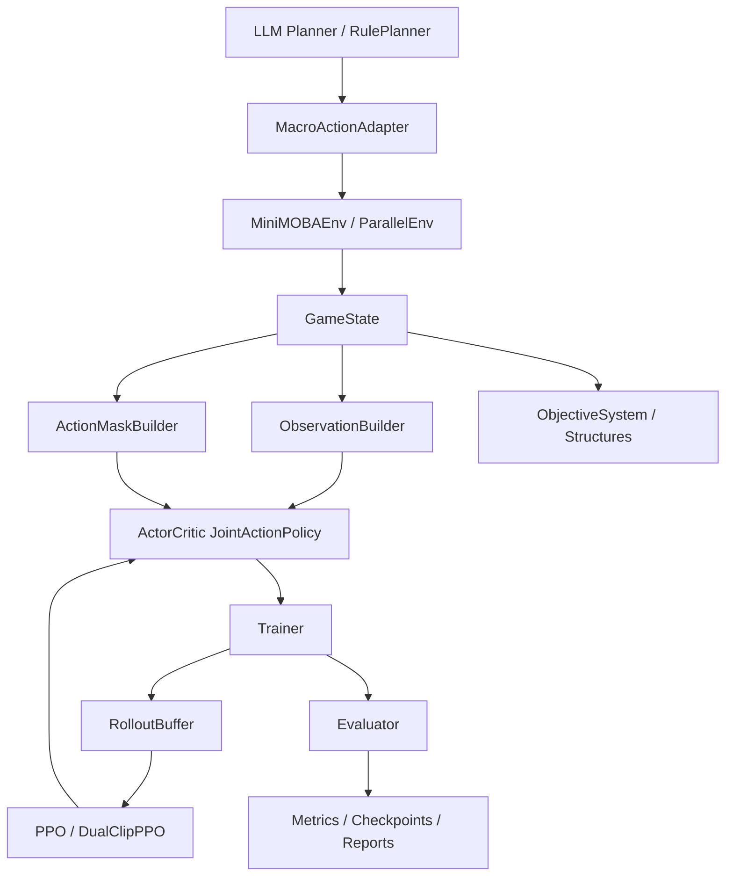

# HybridArena MOBA/RL 主线技术导览

> 文档版本：2026-05-18  
> 适用分支：`master`（叙事已回归 MOBA/RL 主线）  
> 相关文档：`docs/plan.md`、`docs/progress.md`、`docs/issues.md`、`docs/architecture.md`、`docs/experiment-report-v0.md`

---

## 1. 项目定位与当前阶段

**一句话**：在 PettingZoo 4v4 简化 MOBA 环境里，用 **DRL 学微操**，用 **LLM/规则 Planner 学宏观战术**，形成「高层规划 × 底层控制」混合架构。

| 维度 | 状态 |
|------|------|
| 工程闭环 | 已完成：环境、训练、评估、checkpoint、多算法框架、Planner MVP |
| 正式实验 | **未开始**（`docs/progress.md` 中 P1 全为待办） |
| 主线阻塞 | **ISSUE-F13**：有 tower damage 信号，但 RL 策略未稳定打出 hard win（推基地获胜） |
| 实验结论 | 仅有 **smoke**（512 step、1 episode 等），不能当论文/简历最终数字 |

### 安装与验证

```bash
pip install -e ".[dev,rl]"
pytest hybrid_arena/minimoba/tests hybrid_arena/training/tests hybrid_arena/algorithms/tests -v
```

---

## 2. 代码地图（RL 相关目录）

```text
hybrid_arena/
├── minimoba/              # 仿真环境（核心）
│   ├── game_engine.py     # GameState：一步仿真、观测、mask、奖励
│   ├── env.py             # PettingZoo ParallelEnv 封装
│   ├── hero.py            # 英雄配置池 + HeroState
│   ├── map_generator.py   # 地图生成
│   ├── objectives.py      # StructureState（塔/基地）
│   ├── reward_shaper.py   # RewardConfig
│   ├── action_encoding.py # 324 联合动作编解码
│   ├── agents/            # random / rule_based 基线
│   ├── renderer.py        # pygame 渲染（可选）
│   └── tactical_runtime/  # 战术 skill L0/L1 原型（扩展）
├── algorithms/            # PPO / DualClip / MAPPO / QMIX / COMA + networks
├── training/              # Trainer, Buffer, Evaluator, SelfPlayPool, Curriculum
├── inference/             # LLM Planner, RulePlanner, MacroActionAdapter, traces
├── scripts/               # train, evaluate, run_ablation, play_planner, play_human
└── configs/experiments/   # YAML 实验矩阵
```

**说明**：`hybrid_arena/skill_runtime/` 属于 AgentBench 应用层扩展，不在 MOBA/RL 默认训练路径内。

---

## 3. 架构总览



---

## 4. MiniMOBA 环境

### 4.1 API 与智能体

| 项 | 说明 |
|----|------|
| 类 | `MiniMOBAEnv`（`hybrid_arena/minimoba/env.py`） |
| API | PettingZoo **Parallel API**（8 agent 同步 step） |
| Agent ID | `red_0..red_3`、`blue_0..blue_3` |
| 默认参数 | `map_size=32`，`team_size=4`，`max_steps=1000`，`fog_of_war=True` |
| 工厂函数 | `parallel_env()`、`raw_env()`（AEC 包装） |

### 4.2 地图与结构物

- `map_generator.generate_map` 生成：空地、障碍、草丛、红蓝塔、红蓝基地。
- 每队 **2 座塔 + 1 座基地**（`StructureState`：塔 HP 1200，基地 HP 2000）。
- **Hard win**：`terminal_reason == "base_destroyed"`，摧毁对方基地。
- **Timeout**：达到 `max_steps`，按剩余目标 HP 等规则判 soft win / draw。

### 4.3 英雄与角色

- `HERO_POOL`：`tank` / `dps` / `support` 等（`hero.py`）。
- 属性：HP/MP、攻击、移速、两技能（伤害/AOE/治疗/控制）、被动。
- 默认 `DEFAULT_HERO_ASSIGNMENTS` 分配四角色，可通过 `hero_assignments` 覆盖。

### 4.4 单步仿真流程（`GameState.step`）

1. 解析各 agent 的 `[move, skill, target]`。
2. **阶段 1**：同步移动（碰撞、移速、障碍）。
3. **阶段 2**：技能与普攻（CD、MP、伤害、控制）。
4. **阶段 3**：塔/基地受击、摧毁、经济更新。
5. 发放逐步奖励；若开启 objective shaping，追加团队目标奖励。
6. 更新战争迷雾，构建观测。

---

## 5. 动作空间（324 维联合动作）

### 5.1 语义

| 分量 | 大小 | 含义 |
|------|------|------|
| move | 9 | 8 方向 + 不动 |
| skill | 4 | 0=普攻，1/2=技能，3=不攻击 |
| target | 9 | 目标槽位（含「无目标」8） |

**联合索引**（`action_encoding.py`）：

```text
flat = move * (4 * 9) + skill * 9 + target   # ∈ [0, 323]
```

### 5.2 Action Mask

`game_engine._build_action_mask` 生成 **324 维** 0/1 mask：

- 不可行动（如眩晕）：仅 `(move=0, skill=3, target=8)` 合法。
- 技能 CD / MP 不足：屏蔽对应 skill 的所有 target。
- `skill=3`（不攻击）：仅 `target=8` 合法。

策略在 **324 维 joint logits** 上采样，非法动作置 `-1e8`（`networks.ActorCritic`）。v0.2 已修复三头独立采样与联合 mask 不一致问题。

---

## 6. 观测空间

每个 agent 的 `Dict` 观测：

| 键 | 形状 | 内容概要 |
|----|------|----------|
| `local_map` | (11,11,11) | 局部图 11 通道：地形、障碍、草、塔、基地、友军、敌军、位置编码；受战争迷雾影响 |
| `self_state` | (20,) | HP/MP、等级、技能 CD、坐标、金币、经验、控制、KDA 等 |
| `teammate_states` | (3,15) | 最多 3 名队友摘要 |
| `global_info` | (10,) | 步数、击杀、金币差、塔数、自身状态、目标 HP 优势（red−blue 固定视角） |
| `action_mask` | (324,) | 合法动作 |

---

## 7. 奖励系统

### 7.1 基础奖励（`RewardConfig`，默认 `objective_enabled=False`）

| 事件 | 默认权重 |
|------|----------|
| kill / death / assist | +1.0 / -0.8 / +0.3 |
| tower / tower_lost | +2.0 / -2.0 |
| base | +3.0 |
| damage / heal | +0.01 / 点 |
| win / lose | +5.0 / -5.0（仅 base_destroyed 终局在 env 层追加） |
| time_penalty | -0.001 / step |

### 7.2 Objective Shaping（Phase F13，默认关闭）

| 字段 | 默认值 | 含义 |
|------|--------|------|
| `objective_enabled` | `False` | 是否开启 |
| `objective_tower_damage_team` | 0.001 | 团队塔伤 shaping |
| `objective_base_damage_team` | 0.003 | 团队基地伤 shaping |
| `objective_base_exposed_team` | 1.0 | 推掉最后一塔后一次性团队奖励 |
| `objective_step_cap_team` | 0.25 | 每步团队 shaping 上限 |

测试表明 **scripted policy** 可在 2v2 下推塔并触达 base；**RL 长训** 仍未稳定产生 hard win（ISSUE-F13）。

---

## 8. 策略网络（`algorithms/networks.py`）

面向 RTX 4060 8GB，`hidden_dim=48`。

| 模块 | 输出 |
|------|------|
| `MapEncoder` | 3 层 CNN + 空间注意力 → 48 维 |
| `StateEncoder` | self MLP + 队友 MultiheadAttention + global → 144 维 |
| 拼接 | 192 维 |
| move/skill/target head | logits 相加 → 324 维 joint |
| critic | V(s) |

---

## 9. 算法层

### 9.1 主线训练（`scripts/train.py`）

CLI 当前完整集成：**`ppo`**、**`ppo_dualclip`**。

| 算法 | 文件 | 要点 |
|------|------|------|
| PPO | `algorithms/ppo/ppo.py` | GAE、clip、value clip、entropy schedule |
| DualClipPPO | `algorithms/ppo/ppo_dualclip.py` | 负 advantage 下界 `dual_clip_c=3.0` |

**PPOConfig 默认**：`total_timesteps=3_000_000`，`num_steps=128`，`num_envs=4`，`lr=3e-4`，`eval_interval=30_000`。

### 9.2 其它多智能体算法（框架 + 单测，训练 CLI 未全接）

| 算法 | 路径 |
|------|------|
| MAPPO | `algorithms/mappo/` |
| QMIX | `algorithms/qmix/` |
| COMA | `algorithms/coma/` |

### 9.3 Self-play 与课程

- `algorithms/self_play/elo.py`：ELO。
- `algorithms/self_play/manager.py`：与 Trainer 集成。
- `training/self_play.py`：`SelfPlayPool` checkpoint 池。
- `training/curriculum.py`：难度等级与环境参数。

---

## 10. 训练流水线

```text
parallel_env (8 agents)
  → 批处理 ActorCritic.get_action_and_value(obs, action_mask)
  → RolloutBuffer.add(..., action_mask, value)
  → GAE → PPO.update(..., old_values, action_masks)
  → Evaluator / checkpoint
```

- 红蓝 8 agent **共享同一套** `ActorCritic` 权重。
- `SyncParallelEnvRunner` 支持 `num_envs > 1`。

**Smoke 训练**：

```bash
python -m hybrid_arena.scripts.train --algo ppo_dualclip --seed 42 --total-timesteps 512 --num-steps 32 --device cpu
```

---

## 11. 评估系统（`training/evaluator.py`）

主要指标：

| 类别 | 字段 |
|------|------|
| 胜负 | `win_rate`, `draw_rate`, `hard_win_rate`, `timeout_win_rate` |
| 奖励 | `avg_reward`, `avg_red_reward`, `avg_blue_reward` |
| 长度 | `avg_episode_length` |
| 目标 | `avg_tower_damage`, `avg_base_damage`, `base_exposed_rate`, `avg_towers_destroyed` |
| 性能 | `fps` |

**Hard win** 仅当 `terminal_reason == "base_destroyed"`。

```bash
python -m hybrid_arena.scripts.evaluate --opponent rule_based --episodes 3 --seed 42 --output results/eval_smoke.json
```

---

## 12. 基线智能体

| Agent | 文件 | 行为 |
|-------|------|------|
| RandomAgent | `agents/random_agent.py` | mask 内随机 |
| RuleBasedAgent | `agents/rule_based.py` | FSM：patrol / engage / retreat |

---

## 13. LLM Planner 混合层（`inference/`）

### 13.1 宏观动作

`group_mid`, `push_nearest_tower`, `retreat`, `farm_safe`, `protect_support`, `force_teamfight`, `split_push`

### 13.2 组件

| 组件 | 作用 |
|------|------|
| `planner_state.py` / `state_translator.py` | 态势摘要 |
| `rule_planner.py` | 规则对照 |
| `llm_planner.py` | 状态机 + DummyLLMClient |
| `adapter.py` | 宏观 → 合法低级动作 |
| `trace_recorder.py` | PlannerTrace JSONL |

```bash
python -m hybrid_arena.scripts.play_planner --planner rule --max-steps 50 --render-mode none
```

### 13.3 GRPO / QLoRA（远期）

- `training/grpo_trainer.py`：多为 mock，需 planner trace 数据集后再训。
- 目标硬件：RTX 4060 8GB，Qwen2.5-1.5B + QLoRA。

---

## 14. 实验配置与 CLI

### 14.1 YAML（`configs/experiments/`）

| 文件 | 用途 |
|------|------|
| `baseline_smoke.yaml` | 流水线 smoke |
| `baseline_v1.yaml` | 正式矩阵（多数未跑完） |
| `sanity_2v2.yaml` | 2v2 快速验证 |
| `sanity_2v2_objective_shaping.yaml` | 带 objective shaping |

### 14.2 常用脚本

| 脚本 | 作用 |
|------|------|
| `train.py` | PPO / DualClip 训练 |
| `evaluate.py` | 策略评估 |
| `run_ablation.py` | 消融矩阵 |
| `play_planner.py` | Planner 演示 |
| `play_human.py` | 键盘控制 |
| `benchmark_fps.py` | FPS 基准（>500） |

### 14.3 实验报告

见 `docs/experiment-report-v0.md`：**当前为 smoke / partial，非正式 benchmark**。

---

## 15. Tactical Runtime 扩展

`minimoba/tactical_runtime/`：MOBA 侧 L0/L1 战术 skill 原型（workspace、dispatcher、skills），不改变默认 `MiniMOBAEnv` 主路径。

---

## 16. 测试覆盖

- RL 相关：约 96+ 项；全仓约 180 passed，1 skipped（pygame 渲染）。
- 关键：`test_api.py`、`test_objectives.py`、`test_objective_reward.py`、`test_joint_action_policy.py`、`test_ppo_loss.py`、`test_evaluator_metrics.py`。

---

## 17. 主线阻塞：ISSUE-F13

| 现象 | 含义 |
|------|------|
| `tower_damage` 有提升 | 会摸塔 |
| `hard_win_rate = 0` | 极少基地摧毁终局 |
| `base_exposed_rate = 0` | 很少推掉最后一塔 |
| `avg_base_damage = 0` | 几乎不伤基地 |

**建议**（`docs/issues.md`）：

1. scripted / rule 策略验证 base 可达；
2. 检查 objective 与 combat 奖励尺度；
3. 稳定推 base 后再 300k–500k 长训。

---

## 18. 已完成 vs 待办

### 已完成

- 环境、324 mask、迷雾、英雄/地图/结构物  
- PPO/DualClip 训练正确性、Trainer、Buffer、checkpoint  
- Evaluator、train/evaluate/run_ablation CLI  
- MAPPO/QMIX/COMA 框架与单测  
- Self-play / Curriculum 框架  
- LLM Planner MVP、PlannerTrace  
- `demo/moba_app.py`

### 待办

- 正式 baseline_v1 实验矩阵  
- 训练有效性判定脚本  
- 解决 F13 后长训  
- Planner trace → GRPO

---

## 19. 读码与运行顺序

### 读码

1. `minimoba/env.py` → `game_engine.py`  
2. `reward_shaper.py` + `tests/test_objective_reward.py`  
3. `algorithms/networks.py` → `ppo/ppo.py`  
4. `training/trainer.py` → `buffer.py` → `evaluator.py`  
5. `inference/llm_planner.py` + `adapter.py`

### 运行

```bash
pytest hybrid_arena/minimoba/tests/test_smoke.py -v
python -m hybrid_arena.scripts.train --algo ppo --seed 42 --total-timesteps 512 --num-steps 32 --device cpu
python -m hybrid_arena.scripts.evaluate --opponent rule_based --episodes 3 --seed 42
streamlit run hybrid_arena/demo/moba_app.py
```

---

## 20. 与 AgentBench 应用层的关系

| 层级 | 目录 | 说明 |
|------|------|------|
| MOBA/RL 主线 | `minimoba/`, `training/`, `algorithms/`, `inference/` | 本导览范围 |
| AgentBench 应用层 | `core/`, `scenarios/`, `services/api/` | JD/RAG/工单；独立运行，代码保留 |

---

## 附录：关键命令速查

```bash
# 安装
pip install -e ".[dev,rl]"

# 测试
pytest hybrid_arena/minimoba/tests hybrid_arena/training/tests hybrid_arena/algorithms/tests -v
pytest hybrid_arena/ -v

# 训练 / 评估
python -m hybrid_arena.scripts.train --algo ppo_dualclip --seed 42 --total-timesteps 512 --num-steps 32 --device cpu
python -m hybrid_arena.scripts.evaluate --opponent rule_based --episodes 3 --seed 42

# 演示
streamlit run hybrid_arena/demo/moba_app.py
python -m hybrid_arena.scripts.play_planner --planner rule --max-steps 50 --render-mode none
python hybrid_arena/scripts/play_human.py

# 静态检查
ruff check hybrid_arena/
```
